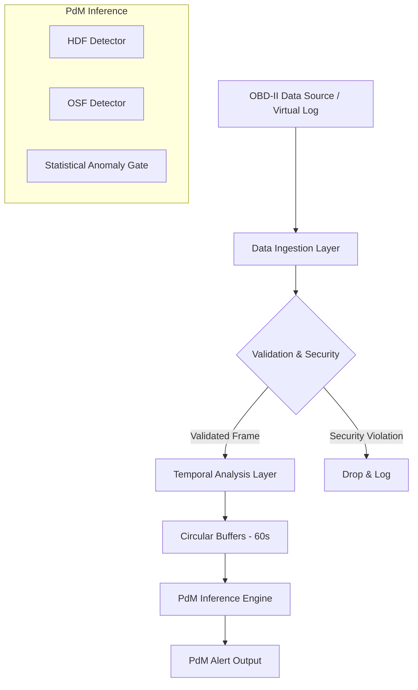

AutoPulse is designed as a modular, read-only analysis pipeline optimized for edge deployment. It separates data ingestion from temporal state management and failure inference.

## System Diagram

## Core Layers

### 1. Data Ingestion & Validation
Defined in the [US-001 Data Contract](/specs/us-001-engine-data-contract/), this layer ensures that incoming sensor data satisfies physical constraints (e.g., RPM < 9,500) and security mandates (e.g., VIN hashing). It normalizes raw automotive signals into a consistent JSON format.

### 2. Temporal Analysis (Stateful)
Because a single OBD frame lacks context, AutoPulse maintains a **60-second sliding window** using high-performance circular buffers. This layer computes rolling statistics (min, max, mean, std_dev) used for drift detection.

### 3. PdM Inference (Algorithms)
The [US-003 Algorithms](/reference/anomaly-detection/) evaluate the temporal state against known vehicle failure modes:
- **HDF**: Uses thermal delta and RPM conjunctions.
- **OSF**: Accumulates workload factor stress with lugging penalties.
- **Statistical**: Monitors Z-score and IQR for unexpected drift in healthy sensors.

## Multi-Agent SDLC Governance

AutoPulse is governed by a 2026 Multi-LLM engineering model. Each layer of the architecture is owned by a specialized agent:

- **Lead Architect (Gemini)**: Defines specifications, research, and mathematical thresholds.
- **Lead Developer (Codex)**: Owns implementation, performance optimization, and repository hygiene.
- **Lead Auditor (Claude)**: Manages adversarial QA, edge-case generation, and final safety sign-off.

This separation of concerns ensures that no feature is implemented without architectural alignment and rigorous adversarial verification.
